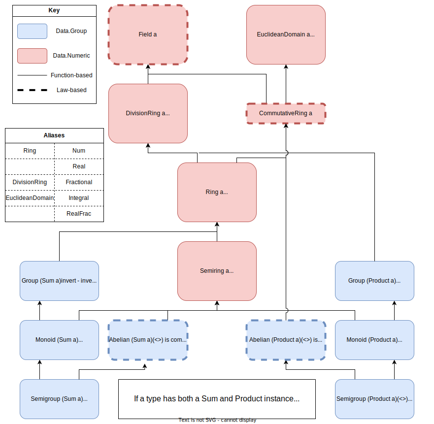

# zlude

Because there weren't enough custom Haskell Preludes.

The Prelude is a standard module imported by default into all Haskell modules unless otherwise stated. It's not perfect, though.

## Project Goals

zlude is explicitly NOT meant to be a general-purpose Prelude replacement. It's rather supposed to be a personal project in reimplementing Prelude features and hopefully a useful tool in my future work. The primary goals of zlude are:

1. Typeclass redesign: The default typeclasses are all well and good, but sometimes we want a little more control—a numeric class without multiplication, or a monad more properly defined using `join` than `bind`. zlude intends to improve typeclass granularity and control, at the cost of increased fussiness and more superclass instances.

2. Modularity: I try to always keep track of which functions come from which import, and Prelude replacements that include dozens of import statements put me on edge. zlude has a miniscule default import, and encourages liberal use of import statements to pull additional features into scope.

3. Similarity to Prelude: Though not every feature in zlude has a Prelude equivalent (or vice versa), I try to provide aliases where necessary to more familiar Prelude features. For example, `Data.Ring.DivisionRing` is equivalent to Base's `Fractional`, so users can optionally use `Fractional` if they so prefer.

## Using zlude

Right now, you really can't—it doesn't work. However, to get a sense of what it's all about:

1. Clone this repository and poke around a little.
2. To run the sample code (unit tests to come), run `runghc Main.hs`. This requires GHC to be installed, but Cabal is as of yet not a requirement.
3. To write a module using zlude, preface your file with `{-# LANGUAGE NoImplicitPrelude #-}` (before the module declaration!) and explicitly state each file you wish to import.
4. To toy around with zlude in GHCi, call `ghci -XNoImplicitPrelude` and include the zlude files you'd like using `:l` rather than `import`.

## Major Changes and Features (more to come!)

1. New numeric hierarchy

We can do so much better than just a plain `Num` class. zlude instead implements a group- and ring-theoretical numeric hierarchy, which requires the existence of Sum and Product instances for each numeric type—daunting, for sure, but hopefully useful for those types you throw together that are number-ish but not strong enough for a Num class of their own. This also encourages use of the Sum and Product typeclasses beyond toys and interesting Monoids.

> ![NOTE]
> Base's Data.Monoid defines Sum and Product as "Monoid under addition" and "Monoid under multiplication" respectively, and provide laws for the relationships between `(<>)` and `(+)` and `(*)`. While this relationship should still hold, zlude's Sum and Product are *less strong* definitions that addition and multiplication—though Product's `(<>)` must distribute over Sum's, a type with definitions for both need not have a Semiring instance and the `(+)` and `(*)` included with that.
